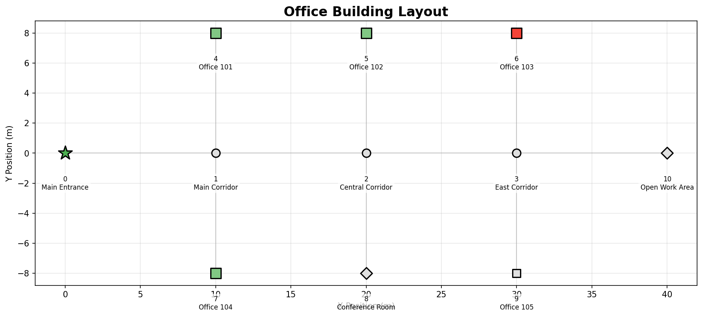
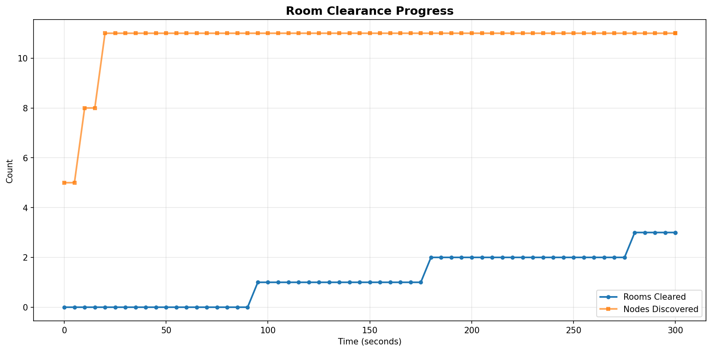
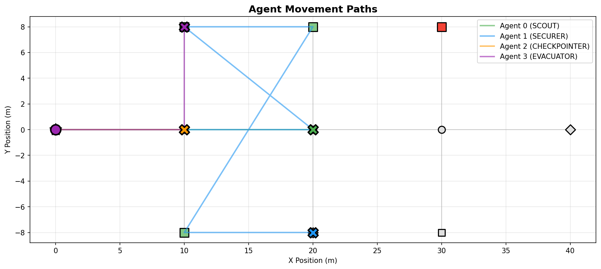

# HASO Emergency Evacuation Simulator

Advanced agent-based modeling environment for planning and validating rapid indoor evacuations with Hierarchical Adaptive Search and Optimization (HASO). The toolkit couples detailed building graphs, multi-role responder policies, and live visualization to help research teams prototype strategies, compare sweep orders, and communicate results.

Python 3.11+ • MIT License • Agent-based simulation • Electrical flow analytics

---

## Table of Contents
- [Overview](#overview)
- [Feature Highlights](#feature-highlights)
- [System Architecture](#system-architecture)
- [Technology Stack](#technology-stack)
- [Getting Started](#getting-started)
- [Quickstart Workflows](#quickstart-workflows)
- [Scenario & Configuration Library](#scenario--configuration-library)
- [Visualization & Analytics](#visualization--analytics)
- [Configuration Reference](#configuration-reference)
- [Development & Quality](#development--quality)
- [Troubleshooting](#troubleshooting)
- [Roadmap](#roadmap)
- [Additional Documentation](#additional-documentation)
- [License](#license)

---

## Overview
The HASO Emergency Evacuation Simulator models coordinated sweeps of complex facilities. Each building is encoded as a weighted graph (rooms, corridors, hazards, exits), while responder agents execute role-specific policies such as scouting, securing, checkpointing, and evacuation confirmation. The simulator records room coverage, evacuee safety, congestion, and hazard remediation, and can replay operations through an interactive dashboard or exported video.

Use cases include:
- Prototyping sweep strategies before field exercises
- Comparing resource allocations across buildings of varying complexity
- Stress-testing response to cascading hazards or broken communication
- Generating polished visuals for competition submissions, briefings, and papers

---

## Feature Highlights

| Feature | Summary |
| --- | --- |
| Hierarchical Agents | Four cooperative roles (Scout, Securer, Checkpointer, Evacuator) execute tailored policies with fog-of-war awareness and dynamic reprioritization. |
| Building Graph Engine | YAML-defined nodes and edges capture geometry, hazards, evacuees, traversal cost, and exit placement; `Graph`, `Node`, and `Edge` classes handle validation and metrics. |
| Electrical Flow Dynamics | `FlowDynamics` models congestion using analogies to circuits (voltages, currents, resistances) to quantify safe throughput along corridors. |
| Zone Optimization | HASO partitions buildings into responder zones and adapts as conditions change, ensuring balanced workloads and minimal overlap. |
| Task Allocation | `task_allocator.py` ranks rooms using multi-factor scoring (distance, hazard, priority, knowledge state) and dispatches agents via discrete-event scheduling. |
| Live Simulation Dashboard | `scripts/run_live_simulation.py` paired with `haso_sim.animate_live` delivers multi-panel analytics, timeline scrubber, overlays for hazards and fog, and exportable MP4 renders. |
| Notebook Toolkit | `notebooks/simulation_demo.ipynb` walks through loading maps, running experiments, plotting layouts, and analyzing outcomes programmatically. |
| Demo Assets | `demo_results/` provides ready-to-use figures that showcase layouts, clearance progress, agent paths, and dashboard snapshots for reports. |

---

## System Architecture

```
HASO/
├── haso_sim/                     # Core simulator package (graph, world, agents, viz)
│   ├── __init__.py               # Public API: load_map, build_world, simulate
│   ├── graph_model.py            # Graph, Node, Edge, YAML loader
│   ├── world.py                  # Discrete-event simulation core
│   ├── agents.py                 # Agent, Role, Status definitions
│   ├── policies.py               # Decision logic + scheduling hooks
│   ├── animate_live.py           # Matplotlib dashboard implementation
│   ├── flow_dynamics.py          # Electrical-flow analytics
│   ├── task_allocator.py         # Multi-criteria prioritization engine
│   ├── zone_optimizer.py         # HASO zone partitioning
│   └── utils.py                  # Config loading, summaries, helpers
├── scripts/
│   ├── run_live_simulation.py    # Real-time dashboard + video export
│   ├── launch_simulation.py      # Batch runner with summary output
│   ├── demo_visual.py            # Static layout/analysis figure exporter
│   └── haso_visualizer.py        # Advanced storytelling visualizer
├── demo_results/                 # PNG outputs used in docs and submissions
├── notebooks/
│   ├── simulation_demo.ipynb     # Guided experimentation notebook
│   ├── data/
│   │   ├── configs/              # Role & weight presets (innovation_hub, etc.)
│   │   └── scenarios/            # Floor-level sweep plans with timing targets
│   └── src/                      # Compatibility shims for legacy imports
├── docs/                         # Topic-specific write-ups (setup, algorithms)
└── requirements.txt              # Python dependencies
```

`haso_sim` is the canonical package while `notebooks` remains as a compatibility alias:

```python
from haso_sim import load_map, build_world, simulate
```

---

## Technology Stack
- Python 3.11+
- `networkx`, `igraph` for graph analytics
- `simpy` for discrete-event scheduling
- `numpy`, `scipy` for numerical routines
- `pulp`, `ortools` for optimization experiments
- `matplotlib`, `seaborn`, `pillow` for visualization
- `jupyterlab`, `ipywidgets` for exploration

Optional tools: `cupy` for GPU acceleration, `pytest`/`black`/`mypy` for quality gates.

---

## Getting Started

### Prerequisites
- Python 3.11 or newer
- pip (or uv/poetry if preferred)
- FFmpeg for MP4 exports (install via package manager if needed)
- Optional: JupyterLab for notebooks, GPU drivers for accelerated math

### Installation
```bash
git clone https://github.com/<your-org>/HIMCM-Topic-A-2025.git
cd HIMCM-Topic-A-2025
python -m venv .venv && source .venv/bin/activate
pip install -r requirements.txt
```

### Validate Environment
```bash
python - <<'PY'
from haso_sim import load_map, build_world
world = build_world("notebooks/data/office_building_simple.yaml")
print(f"Loaded {len(world.G.nodes)} nodes with {len(world.agents)} agents.")
PY
```

---

## Quickstart Workflows

### 1. Batch Simulation Summary
```bash
python scripts/launch_simulation.py \
  --map notebooks/data/office_building_simple.yaml \
  --config notebooks/data/config_baseline.yaml \
  --tmax 600 \
  --seed 42
```
Outputs include clearance statistics, hazard handling notes, agent logs, and serialized history for later visualization.

### 2. Live Dashboard / Video Export
```bash
python scripts/run_live_simulation.py \
  --map notebooks/data/hospital_wing.yaml \
  --config notebooks/data/config_baseline.yaml \
  --duration 420 \
  --fps 20
```
Add `--save-video --video-path results/hospital_run.mp4` for MP4 rendering. Keyboard shortcuts: Space (pause), R (reset), 1–5 (speed presets), H (heatmap), F (flow vectors), S (snapshot).


### 3. Interactive Notebook Exploration
```bash
jupyter lab
# Open notebooks/simulation_demo.ipynb
```
The notebook demonstrates map inspection, fog-of-war visualization, sweep comparisons, and automated report generation (`create_summary_dashboard`, `generate_summary_report`, `analyze_agent_performance`).

---

## Scenario & Configuration Library

| File | Description |
| --- | --- |
| `notebooks/data/office_building_simple.yaml` | Entry-level scenario with 11 nodes and a single hazard; ideal for smoke tests. |
| `notebooks/data/hospital_wing.yaml` | Patient-heavy layout with assisted evacuees and parallel corridors. |
| `notebooks/data/config_baseline.yaml` | Default four-agent team with balanced weights. |
| `notebooks/data/configs/innovation_hub_config.yaml` | Aggressive scout weighting for open-floor innovation hub. |
| `notebooks/data/configs/medical_pavilion_config.yaml` | Emphasizes hazard mitigation and assisted evacuees. |
| `notebooks/data/configs/transit_atrium_config.yaml` | Tunes flows for high-footfall multi-level atriums. |
| `notebooks/data/scenarios/*.yaml` | Pre-authored HASO playbooks aligning zone partitions with architecture. |

All YAML files share the same schema (nodes, edges, hazards, evacuees, metadata). Use `haso_sim.graph_model.load_map_yaml` for validation and `haso_sim.utils.create_building_summary` to inspect coverage metrics.

---

## Visualization & Analytics

- `haso_sim.animate_live`: Matplotlib `FuncAnimation` dashboard with synchronized panels (building map, clearance progress, agent telemetry, flow gauges, hazard timeline, fog state).
- `haso_sim.flow_dynamics`: Computes node pressures and edge currents to quantify congestion; overlays appear as arrows and heat gradients.
- `scripts/demo_visual.py`: Generates static figures (layout, clearance, agent pathing) saved under `demo_results/`.
- `scripts/haso_visualizer.py`: Advanced rendering harness for video storytelling, combining zone optimizer outputs with policy logs.

Example static assets:





---

## Configuration Reference

```yaml
agents:
  - id: 0
    role: SCOUT
    node: 0
    sweep_mode: right        # right, left, corridor
    personal_priority: 4
weights:
  room_priority: 1.5         # higher = chase critical rooms first
  distance: 0.5              # penalty for long travel
  hazard_penalty: 2.0        # discourage entering active hazards
known_nodes: [0, 5]          # initial fog-of-war knowledge
simulation:
  tmax: 600                  # seconds
  record_interval: 3.0
  seed: 42
use_haso: true               # toggle zone optimizer
```

Helpful APIs:

```python
from haso_sim import simulate
results = simulate(
    map_path="notebooks/data/office_building_simple.yaml",
    config_path="notebooks/data/config_baseline.yaml",
    tmax=600,
    seed=42,
    animate=False,
)
world = results["world"]
summary = world.G.get_cleared_count()
```

---

## Development & Quality

| Task | Command |
| --- | --- |
| Lint formatting | `python -m black .` |
| Static typing | `python -m mypy haso_sim` |
| Unit tests | `python -m pytest` |
| Regenerate demo figures | `python scripts/demo_visual.py` |
| Export live run video | `python scripts/run_live_simulation.py --save-video` |

Guidelines:
- Keep repo ASCII-only unless contributing localized docs.
- Avoid committing notebook checkpoints; `.gitignore` covers caches.
- Use feature branches (`v3.0-updates`, etc.) and open PRs with before/after figures.

---

## Troubleshooting

- Import errors: confirm the repository root is on `PYTHONPATH` or run scripts from the project root.
- Missing dependency errors: `pip install --upgrade -r requirements.txt`.
- Headless Matplotlib sessions: `matplotlib.use("Agg")`.
- Video export failures: confirm `ffmpeg` exists in `PATH` and the output directory is writable.
- Simulation stalls: inspect YAML for disconnected graphs using `validate_map()`; ensure every room reaches an exit.
- Zone initialization warnings: `init_zones` can fail on small agent counts; set `use_haso: false` while debugging.

---

## Roadmap
- Expand documentation in `docs/HASO_ALGORITHM.md` with derivations and proofs.
- Integrate optimization outputs directly into the live dashboard (automatic zone reshaping).
- Add stochastic evacuee movement models and medical triage states.
- Provide automated benchmarking harness comparing multiple configs across scenarios.
- Package simulator as a pip module for cleaner reuse in research notebooks.

---

## Additional Documentation
- `docs/GETTING_STARTED.md` — quickstart scripts and notebook walkthrough
- `docs/HOW_TO_RUN.md` — operational checklist for reproducible experiments
- `docs/IMPROVEMENTS_SUMMARY.md` — changelog and research highlights
- `docs/ELECTRICAL_FLOW_MODEL.md` — theoretical background on flow dynamics
- `docs/OBSTACLE_SYSTEM.md` — modeling assumptions for hazards and obstacles

---

## License
Released under the MIT License. See `LICENSE` for full terms.


